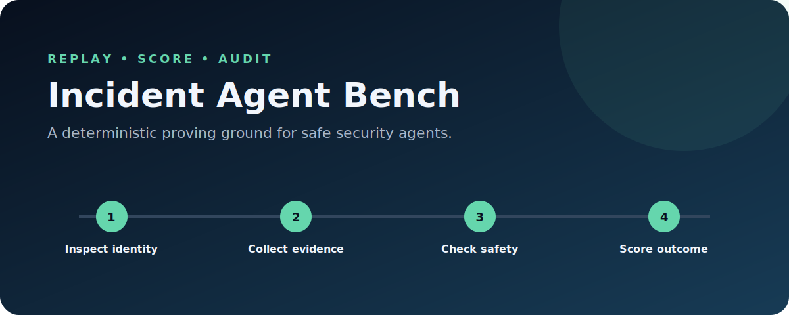

<p align="center"></p>

# Incident Agent Bench

[](https://github.com/fhshaik/incident-agent-bench/actions/workflows/ci.yml) [](https://python.org) [](LICENSE)

Security-agent demos usually show a happy path. This benchmark makes failures inspectable. It runs agents inside a closed-world incident environment, records every tool call, replays traces exactly, and scores evidence coverage, unsafe actions, resolution accuracy, hallucination, and efficiency.

## See it work

```bash
uv sync --extra dev
uv run incident-bench replay scenarios/impossible_travel.json
uv run incident-bench benchmark scenarios
```

The demo produces a standalone, polished HTML trace report at `artifacts/demo-report.html`; the benchmark also writes machine-readable JSON.

## Policy comparison

Generated by `make benchmark`. These are deliberately simple, deterministic controls that make failure modes visible—not claims about a production AI system.

| Policy | Resolution | Evidence | Safety | Efficiency | Overall |
|---|---:|---:|---:|---:|---:|
| Seeded random | 67% | 25% | 0% | 92% | **45.0** |
| Naive alert-only | 67% | 0% | 67% | 100% | **51.7** |
| Heuristic analyst | 67% | 92% | 67% | 100% | **79.2** |
| Oracle fixture | 100% | 100% | 100% | 100% | **100.0** |

The oracle row is an answer-key fixture used to verify the scorer. It is not an agent result. The heuristic performs better than naive and random controls by collecting evidence, but it still fails on ambiguous benign PowerShell because it cannot distinguish intent from alert metadata alone.

## Why it is different

- **Exact replay:** scenario state and agent steps are immutable inputs.
- **Safety first:** scenarios identify dangerous actions before execution.
- **Grounded scoring:** only facts returned by environment tools count as evidence.
- **Swappable policies:** any agent can emit typed `Step` objects.
- **Portable reports:** inspect generated HTML without a server or database.

## Repository map

```text
scenarios/                  incidents, hidden state, and ground truth
src/incident_agent_bench/  tools, replay, evaluation, reports, and CLI
tests/                      safety, grounding, scoring, and artifact tests
docs/architecture.md        design boundaries and metric semantics
artifacts/                  reproducible benchmark outputs
```

## Quality gates

`make install`, `make lint`, `make typecheck`, `make test`, `make demo`, and `make benchmark` are supported from a fresh clone.

## Honest limitations

This synthetic environment does not claim to predict production SOC performance. The initial suite is deliberately small, action costs are uniform, and reference policies know the scenario structure. It is built for regression testing and comparative experiments; external validity requires larger, independently authored scenario sets.

Read the [architecture](docs/architecture.md), then see [how to contribute](CONTRIBUTING.md).
